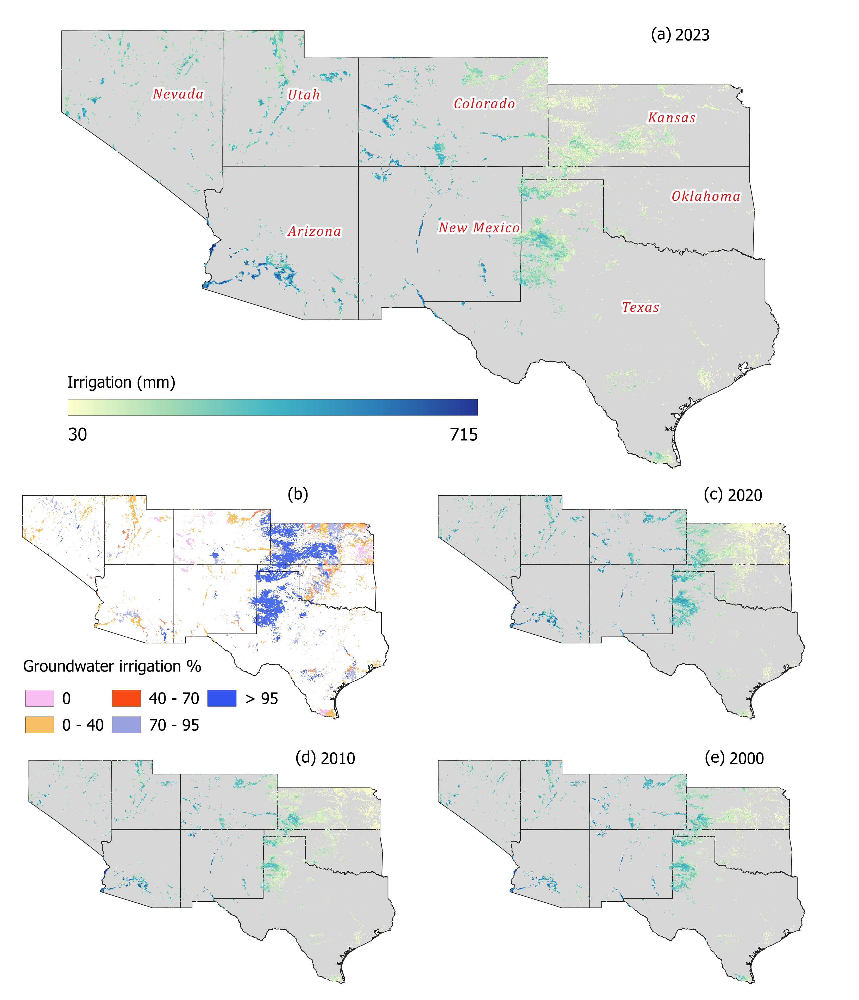

# High-resolution groundwater pumping estimation for the Western United States

Efforts to monitor groundwater pumping for irrigation in the Western United States (Western US) are hindered by the lack of comprehensive pumping records. While previous studies have developed region-specific machine learning models using limited datasets, these models are often not transferable across regions, and a groundwater pumping dataset that goes beyond local and state boundaries remains missing. In this study, we develop a regional-scale, data-driven machine learning framework to address these limitations by integrating remote sensing datasets and in-situ pumping records from Arizona, Colorado, Kansas, and Nevada. Using gridded hydroclimatic and land use variables, including effective precipitation, fraction of irrigated croplands, and evapotranspiration, the model generates spatially continuous, high-resolution (2 km, annual) historical groundwater pumping estimates from 2000 to 2023 for groundwater-dominated basins of the Western US, while predicting total irrigation in conjunctive basins. The model demonstrates good predictive performance under randomized split, with an R2 =0.62, NRMSE = 0.50, NMAE = 0.34, and PBIAS = 8.59% on the test set. Model validation over groundwater-dominated and conjunctive basins across the region shows satisfactory results. In addition, comparisons using spatial holdout analysis and power consumption-based pumping records in multiple basins indicate strong generalization capacity and spatial transferability within the study region. Our assessment identifies limited availability of in-situ pumping records and lack of surface water irrigation datasets as the primary constraints for further advancing such regional-scale frameworks. Overall, the findings highlight that regional transferability of machine learning models for predicting groundwater irrigation is achievable but contingent on holistic representation of the hydrologic system. 

## Predicted pumping and total irrigation maps

## Citations
- Hasan, M. F., Smith, R. G., Davenport, F. V., Majumdar, S. (2026). Extending Historical Groundwater Pumping Estimates for Major Agricultural Basins of the Western United States with Machine Learning and Satellite Products. In Prep. for Journal of Hydrology.

## Organizations
 

## Funding

## Running the repository

### Repository structure
The repository has five main modules described as follows-

__1. utils -__ Consists of scripts that helps in basic raster, vector, and statistical operation. It also holds the `Ml_ops.py` and 'DL_ops.py' scripts which have the machine and deep learning models, repsectively.

__2. download_preprocess -__ Consists of scripts that have functions to download datasets from GEE, including OpenET, and to further pre-process the datasets. The `dp_driver.py` is the main driver script that has to be used to download and pre-process all required datasets.

__3. pumping -__ This module has the 'pumping.py' script that is used to process, filter, and finalize the pumping dataset for Arizona, Colorado, Kansas, and Nevada. The output of this script is the training data for the machine learning model.

__3. models -__ This is the core module than runs the machine learning model, performs Leave-One-Basin-Out spatial validation, and estimates confidence intervals for the predictions. The scripts that are used for the machine learning model start with 'ml_'. 

Note that we have scripts to process dataframe and run an artificail neural network model in this module. However, the final version of this model and resulting manuscript do not incorporate or report its results.

__4. result_analysis -__ Consists of .py scripts and .ipynb files that are used to extract model predictions for individual basins, assess the model perforamnces, etc.

The __utils__ module do not need any execution. The other modules require to be executed using the respective driver files to implement the full funtionality of the model. __Please reach out to the authors for additional support in running this repository.__

### Dependencies
__operating system:__ Most scripts are fully functional in windows and linux environments except some. In linux environment, gdal needs to be installed separately and the appropriate 'gdal_path' needs to be set in necessary scripts. For some functions, e.g. the `shapefile_to_raster()` in `utils > raster_ops.py` and associated scripts (`results_analysis > netGW_pumping_compile.py`), gdal system call has to enabled/installed specifically to run them in linux environment. Note that all scripts, except the scripts in `results_analysis` module, have been implemented/checked using both windows and linux environment (using conda environment). In addition, the ALE plot generation in `m01_peff_model_monthly.py` and `m02_peff_frac_model_water_yr.py` scripts do not respond (keep running indifinitely) in linux environment (probably due to scikit-explain versioning issue); therefore, set `skip_plot_ale = True` when running the monthly and water year models in linux environment.

The authors recommend exercising discretion when setting up the environment and run the scripts.

__conda environment:__ A _conda environment_, set up using [Anaconda](https://www.anaconda.com/products/individual) with python 3.9, has been used to implement this repositories.The 'yml_files_env' folder consists of .yml files to setup similar conda environment.

## Data availability
Will be added shortly.

