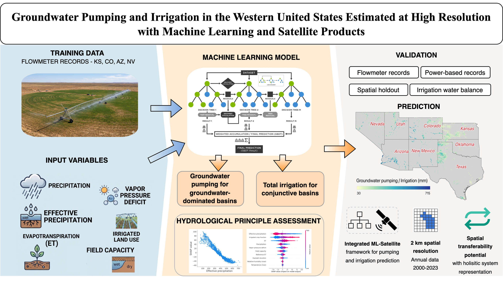
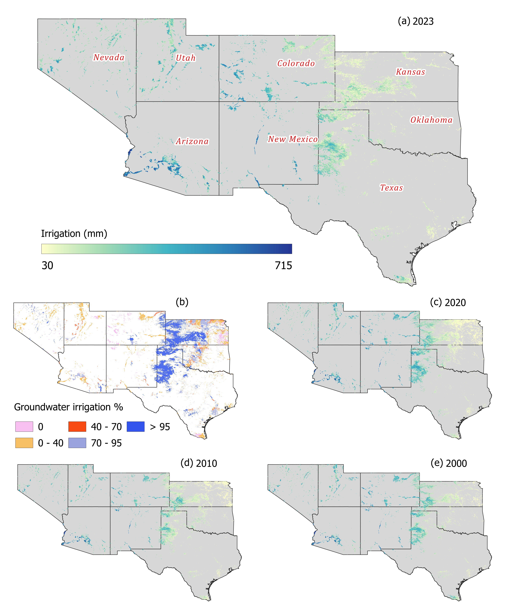

# High-resolution groundwater pumping and irrigation estimates for the Western United States

Efforts to monitor groundwater pumping for irrigation in the Western United States (Western US) are hindered by a lack of comprehensive pumping records. While previous studies have developed region-specific machine learning models using limited datasets, these models are often not transferable across regions, and a groundwater pumping dataset that goes beyond local and state boundaries remains missing. In this study, we develop a regional-scale, data-driven machine learning framework to address these limitations by integrating remote sensing datasets and in situ pumping records from Arizona, Colorado, Kansas, and Nevada. Using gridded hydroclimatic and land use variables, including effective precipitation, fraction of irrigated croplands, and evapotranspiration, the model generates spatially continuous, high-resolution (2 km, annual) historical groundwater pumping estimates from 2000 to 2023 for groundwater-dominated basins of the Western US, while predicting total irrigation in conjunctive basins. The model demonstrates good predictive performance under randomized split, with a Nash-Sutcliffe efficiency (NSE) = 0.62, normalized root mean square error (NRMSE) = 0.50, normalized mean absolute error (NMAE) = 0.34, and percent bias (PBIAS) = 8.59% on the test set. Model evaluation over groundwater-dominated and conjunctive basins across the region shows satisfactory results. In addition, comparisons using spatial holdout analysis and power consumption-based pumping records in multiple basins indicate generalization capacity and spatial transferability within the study region. Our assessment identifies limited availability of in situ pumping records and lack of surface water irrigation datasets as the primary constraints for further advancing such regional-scale frameworks. Overall, the findings highlight that regional transferability of machine learning models for predicting groundwater irrigation is achievable but contingent on holistic representation of the hydrologic system. 

## Graphical Abstract


## Table of Contents
- [Predicted pumping and total irrigation maps](#predicted-pumping-and-total-irrigation-maps)
- [Running the repository](#running-the-repository)
- [Data availability](#data-availability)
- [Citations](#citations)
- [Organizations](#organizations)
- [Funding](#funding)

## Predicted pumping and total irrigation maps


## Running the repository

### Repository structure
The repository has five main modules described as follows-

```
Codes/
├── __init__.py
├── download_preprocess/
│   ├── download.py
│   ├── download_openET.py
|   ├── preprocess.py
│   ├── dp_driver.py
│   └── dp_driver.sh
├── models/
│   ├── ann_df.py
│   ├── ann_df.sh
│   ├── ann_model.py
│   ├── ann_model.sh
│   ├── ml_driver.py
│   ├── ml_driver.sh
│   ├── ml_driver_LOBO.py
│   ├── ml_driver_LOBO.sh
│   ├── ml_uncertainty.py
│   └── ml_uncertainty.sh
├── pumping/
│   └── pumping.py
├── results_analysis/
│   ├── __init__.py
│   ├── analysis_utils.py
│   ├── basin_compile.py
│   ├── basin_compile_LOBO.py
│   ├── comparison_basinScale.ipynb
│   ├── conjuctive_basins_water_balance.ipynb
│   ├── model_diagnosis.ipynb
│   ├── plots.py
│   └── stats_ops.py
└── utils/
    ├── __init__.py
    ├── DL_ops.py
    ├── ML_ops.py
    ├── plots.py
    ├── raster_ops.py
    ├── stats_ops.py
    ├── system_ops.py
    └── vector_ops.py

Data_main/
├── pumping/
│   ├── Arizona/
│   ├── Colorado/
│   ├── Kansas/
│   ├── Nevada/
│   └── Utah/
├── ref_rasters/
├── ref_shapes/
└── shapefiles/
    └── Basins_of_interest/
```

__1. utils -__ Utility scripts for core operations across the repository:
- `raster_ops.py` - Raster processing (read/write arrays, clipping, resampling, masking)
- `vector_ops.py` - Vector operations (buffering, clipping shapefiles, coordinate transformations)
- `stats_ops.py` - Statistical metrics (RMSE, MAE, R², NRMSE, PBIAS calculations)
- `ML_ops.py` - Machine learning operations using LightGBM (data preparation, training, hyperparameter tuning via Hyperopt, SHAP analysis, prediction)
- `DL_ops.py` - Deep learning operations using PyTorch (DataLoader, ANN model architecture, training with Optuna optimization)
- `plots.py` - Visualization utilities
- `system_ops.py` - File system operations

__2. download_preprocess -__ Scripts for data acquisition and preprocessing:
- `download.py` - Functions to download data from Google Earth Engine (GRIDMET, DAYMET products)
- `download_openET.py` - Functions to download OpenET and irrigation fraction datasets (IrrMapper, LANID)
- `preprocess.py` - Data preprocessing and compilation functions
- `dp_driver.py` - Main driver script that executes functionalities in `download.py`, `download_openET.py`, and `preprocess.py` to download and preprocess all datasets

__3. pumping -__ Pumping data processing module:
- `pumping.py` - Processes, filters, and rasterizes in-situ pumping records from Arizona, Colorado, Kansas, and Nevada. Includes well coordinate transformation, data quality filtering, and rasterization. Output serves as training data for the ML model.

__4. models -__ Core machine learning module:
- `ml_driver.py` - Main ML driver for model training, testing, and prediction using LightGBM DART
- `ml_driver_LOBO.py` - Leave-One-Basin-Out (LOBO) cross-validation driver for spatial transferability assessment
- `ml_uncertainty.py` - Bootstrap-based uncertainty quantification and confidence interval estimation
- Associated `.sh` scripts for HPC job submission

__5. results_analysis -__ Model evaluation and results compilation:
- `basin_compile.py` / `basin_compile_LOBO.py` - Compile basin-scale predicted and actual pumping data
- `analysis_utils.py` - Utility functions for results analysis
- `comparison_basinScale.ipynb` - Basin-scale comparison of actual vs predicted pumping with scatter plots, time series analysis, and performance metrics (R², RMSE, MAE) across groundwater-dominated basins
- `conjuctive_basins_water_balance.ipynb` - Water balance analysis for conjunctive basins (South Platte River Basin, CO and Pinal AMA, AZ) to compute total irrigation from groundwater and surface water sources
- `model_diagnosis.ipynb` - Model performance diagnostics
- Various notebooks for water balance analysis and result visualization

The __utils__ module does not require direct execution. Other modules should be executed using their respective driver files. __Please reach out to the authors for additional support in running this repository.__

### Execution workflow
For full model implementation, execute modules in the following order:
1. **download_preprocess** → Run `dp_driver.py` to download and preprocess all input datasets
2. **pumping** → Run `pumping.py` to process and rasterize in-situ pumping records (training data)
3. **models** → Run `ml_driver.py` for model training/prediction or `ml_driver_LOBO.py` for spatial validation
4. **results_analysis** → Use notebooks and scripts to analyze model outputs

### Dependencies
__conda environment:__ A _conda environment_, set up using [Anaconda](https://www.anaconda.com/products/individual) with Python 3.9, has been used to implement this repository. The `yml_files_env` folder contains `.yml` files to set up similar conda environments for both Linux and Windows.

__Key packages:__
- `lightgbm` - LightGBM DART regressor for ML modeling
- `hyperopt` - Bayesian hyperparameter optimization  
- `shap` - Model interpretability and feature importance
- `rasterio`, `gdal` - Geospatial raster operations
- `geopandas` - Vector data processing
- `torch` - PyTorch for deep learning (experimental ANN)
- `optuna` - Neural network hyperparameter tuning
- `earthengine-api` - Google Earth Engine data access

## Data availability
This repository includes the in-situ pumping datasets and associated shapefiles used to process and train the ML model. The `Data_main/pumping/` folder contains state-level pumping records from Arizona, Colorado, Kansas, Nevada, and Utah, along with reference rasters, shapefiles, and basin boundaries required for data processing and model implementation.

**Direct download:**  
The annual groundwater pumping/total irrigation estimates (2000-2023) are available in the following GitHub directory for direct download. Users can directly download it and open using any GIS software such as QGIS.
```
https://github.com/mdfahimhasan/WestUS_pumping/tree/main/Data_main/rasters/pumping_prediction/ML/v11
```

**Google Earth Engine Dataset:**  
The annual groundwater pumping/total irrigation estimates (2000-2023) are available as a Google Earth Engine ImageCollection:
```
projects/ee-westus-pumping/assets/westus_pumping
```

> **Note:** The dataset represents groundwater pumping in groundwater-dominated basins, but total irrigation in conjunctive basins (where significant surface water irrigation is supplemented by groundwater supply). The groundwater-dominated vs conjunctive basin classification can be visualized by the `GW_use_binary` asset, provided in the following GEE code snippet.

Sample code for visualization and data download from GEE is available at:  
https://code.earthengine.google.com/5f5f1dcc3840126545e6860015c982e8


**HydroShare repository:**

The annual groundwater pumping/total irrigation estimates (2000-2023) can also be downloaded from the following HydroShare repository.
```
https://www.hydroshare.org/resource/cce80224863c4933a94c51a25c4ff8f3/
```

**Dataset Citation:**
Hasan, M. F., Smith, R. G., Davenport, F. V., & Majumdar, S. (2026). Dataset: Historical groundwater pumping estimates for major agricultural basins of the Western United States, HydroShare, https://doi.org/10.4211/hs.cce80224863c4933a94c51a25c4ff8f3

## Manuscipt citation
- Hasan, M. F., Smith, R. G., Davenport, F. V., Majumdar, S. (2026). Extending Historical Groundwater Pumping Estimates for Major Agricultural Basins of the Western United States with Machine Learning and Satellite Products. In Prep. for Journal of Hydrology.

## Organizations
 

## Funding
